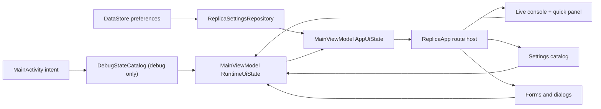

# Architecture

## Design constraints

The audit is the behavioral and visual source of truth; inferred internals are not reproduced. The app is a single-activity native Kotlin/Compose application with an explicit route model, immutable UI snapshots, one-way event handling, DataStore persistence for the confirmed durable settings, and debug-only deterministic state injection.

No production network, camera, microphone, recording, authentication, arbitrary HTML, or proprietary bonding implementation is present. These boundaries are intentional and replaceable behind future repository interfaces if separate authorization and protocol documentation are supplied.

## Runtime flow

`AppUiState` combines durable `ReplicaSettings` with transient `RuntimeUiState`. Screen-specific debug overrides are layered over preferences without writing them, so capturing state 020 or 090 cannot corrupt the user's durable configuration.

## Navigation and back behavior

`AppRoute` has two top-level shapes: `LiveConsole` and `Settings(page)`. Settings pages are enumerated rather than stringly typed. `MainViewModel` owns the back stack and consumes Back in this order:

1. dismiss an open dialog;
2. close the live quick panel;
3. pop the current settings/form destination;
4. background the task from the live console.

Debug state mappings construct the correct parent stack so Back behaves normally even when QA launches directly into a nested audited state.

## Screen rendering

- `ui/live/LiveConsoleScreen.kt` implements the preview composition, console controls, telemetry, meter, grid, safe margins, timestamp, lenses, and start guard.
- `ui/live/QuickSettingsPanel.kt` implements Camera, Network, Display, Overlays, Audio, and Log tabs.
- `ui/settings/SettingsCatalog.kt` is the data-driven source for recurring settings rows and actions.
- `ui/settings/SettingsScreen.kt` renders settings categories and audit scroll anchors.
- `ui/settings/Forms.kt` implements connection, picture/text/timestamp layer, and web-overlay editors.
- `ui/components/` contains measured app bars, rows, switches, sliders, text fields, and dialog surfaces.
- `debug/DebugStateCatalog.kt` maps all 145 catalog IDs and four named non-default states to deterministic UI state. `BuildConfig.ENABLE_DEBUG_STATE_SELECTOR` is false in release.

## Persistence and lifecycle

DataStore persists the audited user settings (toggles, weights, gain, bitrate, margin configuration, and overlay flags) across activity and process recreation. Dialogs, quick-panel state, transient editor drafts, one-shot toasts, and visual-validation overrides intentionally reset. The activity remains landscape and reapplies observed status/navigation-bar treatment on route changes.

## Security and privacy boundary

The manifest contains no camera, microphone, storage, or Internet permission. Folder selection uses Android's system-owned Storage Access Framework without reading or writing selected content. Text entered into local fixtures is stored only when a confirmed preference mapping exists; mock credentials are never persisted or transmitted. The original package and its private storage are never accessed.

## Signing

Release signing is supplied through environment variables and kept outside the
repository. Release builds are minified and resource-shrunk. Debug builds use the
same external identity when it is configured, otherwise they use the local Android
debug identity.
